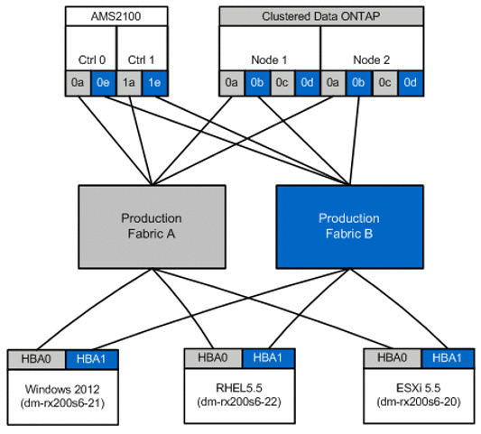

= Erstellen des Hosts zu Zielzonen
:allow-uri-read: 
:icons: font
:imagesdir: ../media/

[role="lead"]
Sie müssen den Host zu Zielzonen erstellen. Es gibt zwei Arten von Produktionsgewebe, Stoff A und Stoff B.

Folgende Abbildung zeigt das Host- und Ziel-Storage Zoning.

Produktionszonen sind in Produktionsgewebe A.

[cols="3*"]
|===
| Zone | WWPN | Mitglieder Der Zone 

 a| 
Zone: Rx21_flicDOT
 a| 
21:00:00:24:ff:30:14:c5

20:01:00:a0:98:2f:94:d1

20:03:00:a0:98:2f:94:d1
 a| 
RX21 HBA 0

FliCDOT Lif1

FliCDOT Lif3

 a| 
Zone: Rx22_flicDOT
 a| 
21:00:00:24:ff:30:04:85

20:01:00:a0:98:2f:94:d1

20:03:00:a0:98:2f:94:d1
 a| 
RX22 HBA 0

FliCDOT Lif1

FliCDOT Lif3

 a| 
Zone: rx20_flicDOT
 a| 
21:00:00:24:ff:30:03:EA

20:01:00:a0:98:2f:94:d1

20:03:00:a0:98:2f:94:d1
 a| 
RX20 HBA 0

FliCDOT Lif1

FliCDOT Lif3

|===
Produktionszonen in Produktionsgewebe B.

[cols="3*"]
|===
| Zone | WWPN | Mitglieder Der Zone 

 a| 
Zone: Rx21_flicDOT
 a| 
21:00:00:24:ff:30:14:c4

20:02:00:a0:98:2f:94:d1

20:04:00:a0:98:2f:94:d1
 a| 
RX21 HBA 1

FliCDOT lif2

FliCDOT Lif4

 a| 
Zone: Rx22_flicDOT
 a| 
21:00:00:24:ff:30:04:84

20:02:00:a0:98:2f:94:d1

20:04:00:a0:98:2f:94:d1
 a| 
RX22 HBA 1

FliCDOT lif2

FliCDOT Lif4

 a| 
Zone: rx20_flicDOT
 a| 
21:00:00:24:ff:30:03:eb

20:02:00:a0:98:2f:94:d1

20:04:00:a0:98:2f:94:d1
 a| 
RX20 HBA 1

FliCDOT lif2

FliCDOT Lif4

|===