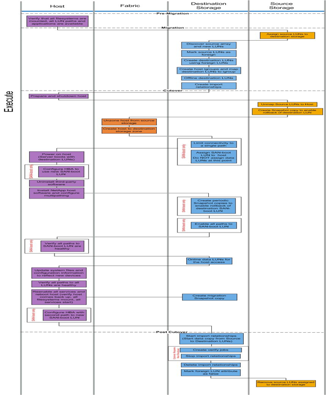

= Online-Migrations-Workflow
:allow-uri-read: 
:icons: font
:imagesdir: ../media/

[role="lead"]
Der Online-Migrations-Workflow wird in der Ausführungsphase des Migrationsprozesses durchgeführt. Das Online-Workflow-Diagramm zeigt die Aufgaben, die auf dem Host, der Fabric, dem Ziel-Storage und dem Quell-Storage ausgeführt werden.

Die Online-Workflow-Aufgaben sind in der folgenden Tabelle aufgeführt.

[cols="2*"]
|===
| Komponente | Aufgaben 

 a| 
Host
 a| 
. Vergewissern Sie sich, dass alle Dateisysteme gemountet sind und alle LUN-Pfade und -Applikationen verfügbar sind.
. *Optional:* Wenn die zu importierenden LUNs für ESX sind, überprüfen und befolgen Sie die Anweisungen in Anhang A: ESX CAW/ATS Remediation.
. Bereiten Sie die Hosts vor und fahren Sie sie herunter.
. Schalten Sie die Hosts mit Ziel-LUNs ein.
. Konfigurieren Sie den HBA zur Verwendung der neuen SAN-Boot-LUN (nur SAN-Boot).
. Deinstallieren Sie MPIO von Drittanbietern.
. Installation der NetApp Host Software und Konfiguration von Multipathing.
. Überprüfen Sie, ob alle Pfade zu SAN-Boot-LUN ordnungsgemäß sind (nur SAN-Boot).
. Aktualisieren Sie Systemdateien und die Konfiguration, um neue Geräte wiederzugeben.
. Vergewissern Sie sich, dass alle Pfade zu allen LUNs ordnungsgemäß sind.
. Reaktivieren Sie alle Services und starten Sie den Host neu (überprüfen Sie, ob der Host wieder verfügbar ist, alle Dateisysteme gemountet werden, alle Dienste beginnen).
. Konfigurieren Sie den HBA mit dem zweiten Pfad zur neuen SAN-Boot-LUN (nur SAN-Boot).

 a| 
Fabric
 a| 
. Heben Sie die Zone des Hosts vom Quellspeicher auf.
. Host zu Ziel-Speicherzone erstellen.

 a| 
Ziel-Storage
 a| 
. Erkennen des Quell-Arrays und der neuen LUNs
. Quell-LUNs als „fremd“ markieren.
. Erstellen Sie Ziel-LUNs mithilfe von ausländischen LUNs.
. Host-Initiator-Initiatorgruppen erstellen und Ziel-LUNs der Initiatorgruppe zuordnen.
. Offline der Ziel-LUNs.
. Entfernen Sie Hosts aus dem Quell-Array-LUN-Masking (Initiatorgruppen).
. Erstellen von Importbeziehungen und Starten von Importjobs.
. Führen Sie oben Schritt 4 des Hosts aus (Hosts den neuen LUN-Standorten neu zuordnen).
. Beschränkung der Konnektivität auf einen einzelnen Pfad (nur SAN-Boot)
. Weisen Sie dem Host SAN Boot LUN zu; weisen Sie zu diesem Zeitpunkt keine Daten-LUNs zu (nur SAN Boot).
. Erstellen Sie regelmäßige Snapshot Kopien, um Rollbacks von Ziel-SAN Boot LUN zu ermöglichen (nur SAN Boot).
. Aktivieren Sie alle Pfade zum SAN-Boot-LUN (nur SAN-Boot).
. Online-Ziel-LUNs:
. Erstellen Sie eine Snapshot Kopie, um Rollbacks der Ziel-LUN zu ermöglichen.
. Starten von Importbeziehungen (Datenkopieerstellung von Quell- zu Ziel-LUNs).
. Erstellen Sie Jobs überprüfen und stoppen Sie Importbeziehungen (optional).
. Importbeziehungen löschen.
. Markieren Sie das Attribut „Foreign LUN“ auf „false“.

 a| 
Quell-Storage
 a| 
. Quell-LUNs dem Ziel-Storage zuweisen
. Zuordnung von Quell-LUNs zu Host aufheben
. Erstellen Sie Snapshot Kopie, um Rollbacks der Ziel-LUN zu ermöglichen.
. Entfernen Sie die Quell-LUNs, die dem Ziel-Storage zugewiesen sind.

|===