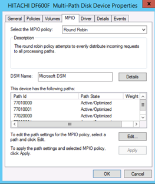

= Multipath-Verifizierung für Windows Hosts
:allow-uri-read: 
:icons: font
:imagesdir: ../media/

[role="lead"]
Im Rahmen des Foreign LUN Import (FLI)-Prozesses sollten Sie überprüfen, ob Multipath auf Ihren Hosts konfiguriert und ordnungsgemäß funktioniert.

Führen Sie die folgenden Schritte für Windows-Hosts durch.

.Schritte
. Open Disk Management
+
.. Klicken Sie auf dem Windows-Desktop auf *Start*.
.. Geben Sie im Feld Suche starten einen Suchbegriff ein `diskmgmt.msc`.
.. Klicken Sie in der Liste Programme auf `diskmgmt`.

. Klicken Sie mit der rechten Maustaste auf jedes Laufwerk, für das Sie die verschiedenen Pfade überprüfen möchten, und klicken Sie dann auf *Eigenschaften*.
. Klicken Sie auf der Registerkarte MPIO in der Liste MPIO-Richtlinie auswählen auf alle aktiven Pfade.
+

+
Um Multipathing über die Befehlszeile zu überprüfen, führen Sie die folgenden Schritte aus:

. Öffnen Sie die Windows-Eingabeaufforderung.
. Führen Sie mpclaim.exe --V c:\multipathconfig.txt aus, um die Multipath-Konfiguration zu erfassen.

